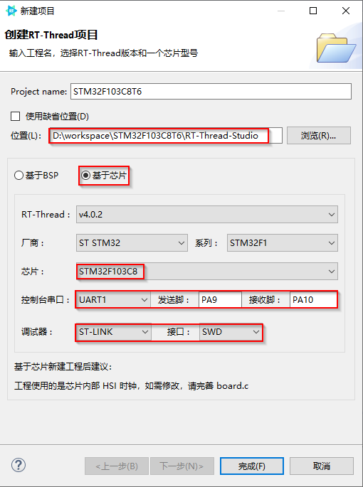

# RT-Thread-Studio

## RT-Thread-Studio下载
浏览器中输入https://www.rt-thread.org/page/download.html，然后选择下载RT-Thread Studio，下载完成安装即可。

## 如何创建工程
以STM32F103C8T6板为例

- 打开RT-Thread Studio，点击“文件”->“新建”->“RT-Thread项目”

- 填写如下信息：

其中工程名，工程位置，使用的芯片，调试器等根据实际情况选择。

## 参考